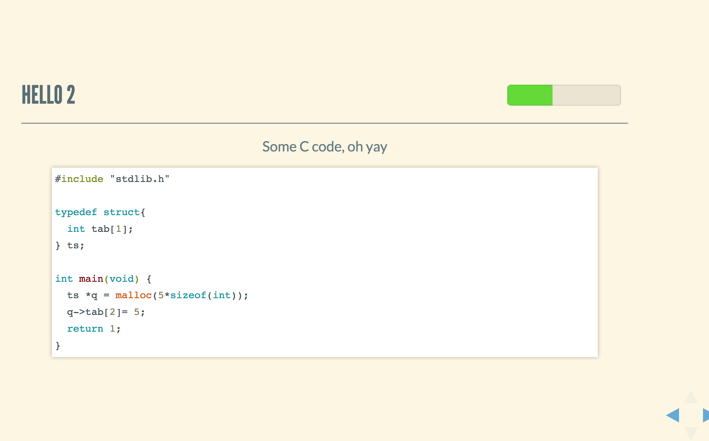

# ez-lectures

Easily make beautiful lectures!

# Usage

Install with: 
```
$ yarn global add @algebr/ez-lectures
```

or 
```
$ npm install -g @algebr/ez-lectures
```

`ez-lectures` uses some sensible defaults for theming

```
$ ez-lectures --src-slides slides-data.js --watch
```

But you can control it as well, see the `--help` flag to get links of
where you can find all the available names for theming.

```
$ ez-lectures --src-slides slides-data.js --watch --slide-theme solarized --code-theme arduino-light
```

## Data structures expected for lectures. 

```
type metadata = {
  title: string,
  global_styles: string
}

type title_slide = {
  lecture_name: string
  location: {presentation_spot: string, geographic_location: string},
  author: {name: string, twitter: string, github: string},
  title: string,
  byline: ?string, 
}

type slide = {
  title:string,
  content: Array<
    | string 
    | {code: string, programming_language: string}
    | {link: string}
  >,
}

```

See `example/data.js` for an example of correct slide data input.

```
ez-lectures --src-slides data.js --watch
```


```
ez-lectures --src-slides data.js --watch --slide-theme solarized --code-theme arduino-light
```


